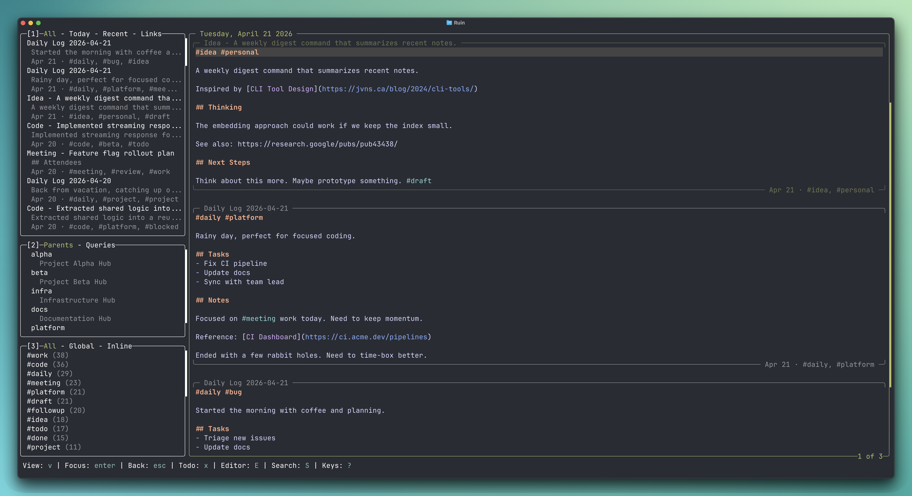

# lazyruin

[](https://github.com/donnellyk/lazyruin/actions/workflows/ci.yml)
[](https://github.com/donnellyk/lazyruin/releases/latest)
[](go.mod)
[](LICENSE)

A terminal UI for the [`ruin`](https://github.com/donnellyk/ruin-note-cli)
note-taking CLI. 

Don't organize; compose. Write small, atomic notes saved as simple markdown files. Later, compose them into different "documents", depending on your needs. This probably has an audience of one (me) or zero (turns out, not me); time will tell.



## Installation

### Homebrew (recommended)

```
brew install donnellyk/ruin/lazyruin
```

This installs both `lazyruin` and the `ruin` CLI it depends on.

### `go install`

Requires Go 1.26+:

```
go install github.com/donnellyk/lazyruin@latest
```

You'll need the `ruin` CLI on `PATH` separately.

### From a local checkout

Requires Go 1.26+ and [mise](https://mise.jdx.dev):

```
git clone https://github.com/donnellyk/lazyruin
cd lazyruin
mise run install
```

## Quick start

```
$ lazyruin
```

If you don't have a `vault_path` configured, you'll have the option to create one on first launch in your current directory. Override with `--vault /path/to/vault` or the `LAZYRUIN_VAULT`
environment variable.

On launch with an empty vault, you'll be asked if you want to go through an onboarding tutorial (to explain what the hell is going on). Follow your heart.

Core keys:

| Key     | Action               |
| ------- | -------------------- |
| `q`     | Quit                 |
| `S`     | Search notes         |
| `n`     | New note             |
| `<c-l>` | New link             |
| `p`     | Pick (tag filter)    |
| `:`     | Command palette      |
| `c-o`    | Quick Open           |
| `?`     | Keybindings help     |
| `Tab`   | Next panel           |

Quick direct-launch modes, which exit on save or close:

```
lazyruin --new                 # straight into new-note capture
lazyruin --link                # open the new-link input popup
lazyruin --link=https://...    # resolve the URL directly
```

See [`docs/keybindings.md`](docs/keybindings.md) for the full reference.

## Key Features

### Notes are just markdown files
Your notes are just plain markdown files on a disk. Ruin vaults should _generally_ be compatible with Obsidian vaults (though extensive testing hasn't happened) and similar markdown tools.

### Context-Aware Tags
In Ruin, there are two kinds of tags: inline & global. An inline tag is a tag that is in a line of text. A global tag is a tag that's in the frontmatter, or on its own line, or on a line with only tags (and separators).

In the following example
```
I went to a very important meeting.

I should follow up with that very important thing #followup

#meeting, #projectA
```

#meeting and #projectA are global tags and #followup in an inline tag. 

Use `ruin search` to find whole files and `ruin pick` finds & extracts specific lines (based on inline tags and other parameters).

### Strong date awareness, but no daily note
When you have a daily note, everything you add to your vault comes with the question: should this go into the daily note or its own note? If you add it to the Today note, it might be hard to find later. If you add it to a relevant note or its own, you lose the context of the date. If you are like me, in event thinking about that question, you've forgotten what you wanted to write down in the first place.

Ruin tries to fix this with strong date awareness, date querying, and `ruin today`. This gets even more useful in the [TUI](https://github.com/donnellyk/lazyruin), with a dynamically generated Today view (plus Tomorrow, and any other date).

### Zettelkasten-ish atomic notes, composed into larger documents as needed
Don't think about adding a new section to a larger document, just write down what you want to capture and give the note a parent. From there `ruin compose` can build an entire document for easy reading and editing*

*editing is a bit limited for now but I hope to expand it to allow for editing as if it was a single document.


## Other Questions
### Should I Use This Yet?
Maybe. It's under active-development. Due to it just being a folder on your hard drive, data loss is unlikely but possible (back up your data either way). The CLI contract might have breaking changes until 1.0. I will try to minimize breaking changes and allow for migration via `ruin doctor` where I can.

### What's your roadmap?
I want to use/explore the feature set in the CLI/TUI for now. Some of these ideas might be too abstract/complex for day-to-day use, and significantly changing or removing them will be necessary. That's fastest when there is just a core CLI and TUI to update.

From there, an iOS and Mac app focused on quickly capturing notes will be next, reading and interacting with a full vault after that.

Finally, the intention is to have a polished, native experience on both Mac and iOS, with all the querying and editing capabilities of a modern notes app. We'll see if we get there.

The CLI and TUI will always be free and open-source. The iOS and Mac apps will be closed source and come with a small subscription, offering a limited vault size as a free tier.

Linux, Windows, and Android support are not the focus at this time; the CLI and TUI might work with them, but compatibility has not been rigorously tested.

### What's With the Name?
The pretentious answer is it's a reference to _The Waste Land_ by T.S. Eliot (that I'm likely misinterpreting). 
> These fragments I have shored against my ruins.

The real answer is it's memorable, short, and aesthetically pleasing.

### Doesn't <OrgMode|Obsidian|Lotus Notes|Notion>  do this already?
Yes. Nevertheless, here we are. 

## Documentation

- [`docs/keybindings.md`](docs/keybindings.md) — full keybinding reference
- [`docs/architecture.md`](docs/architecture.md) — architecture and layer overview
- [`CHANGELOG.md`](CHANGELOG.md) — release notes

## License

MIT. See [LICENSE](LICENSE).

## AI Usage
Claude Code was used extensively on this project. All code was read, tested, reviewed, and committed by a human.
